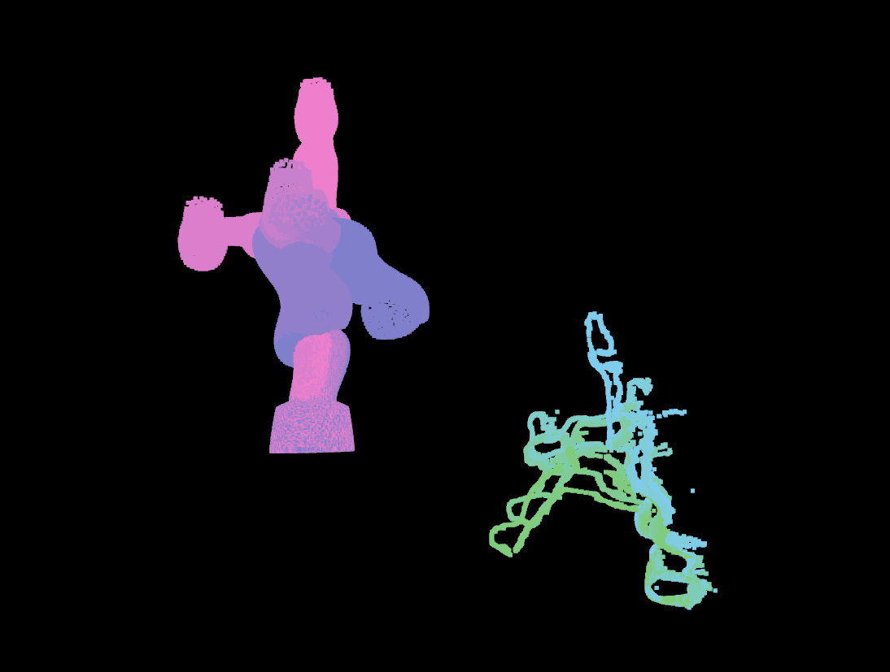
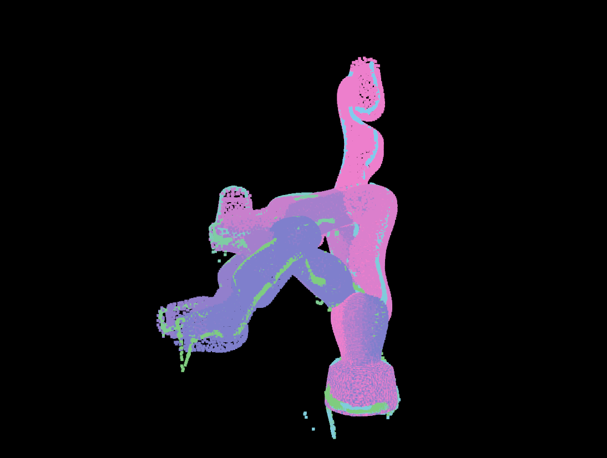

# Roboreg
[](https://github.com/lbr-stack/roboreg?tab=Apache-2.0-1-ov-file)
[](https://github.com/psf/black)

Eye-to-hand calibration from RGB-D images using robot mesh as calibration target.

<body>
    <table>
    <caption>Mesh (purple) and Point Cloud (turqoise).</caption>
        <tr>
            <th align="left" width="50%">Unregistered</th>
            <th align="left" width="50%">Registered</th>
        </tr>
        <tr>
            <td align="center"></td>
            <td align="center"></td>
        </tr>
    </table>
</body>

## Table of Contents
- [Installation](#installation)
    - [Pip (Requires CUDA Toolkit Installation)](#pip-requires-cuda-toolkit-installation)
    - [Conda (Installs CUDA Toolkit)](#conda-installs-cuda-toolkit)
    - [Docker (Comes with CUDA Toolkit)](#docker-comes-with-cuda-toolkit)
- [Command Line Interface](#command-line-interface)
    - [Segment](#segment)
    - [Hydra Robust ICP](#hydra-robust-icp)
    - [Camera Swarm](#camera-swarm)
    - [Stereo Differentiable Rendering](#stereo-differentiable-rendering)
    - [Render Results](#render-results)
- [Testing](#testing)

## Installation
Three install options are provided: 
- [Pip (Requires CUDA Toolkit Installation)](#pip-requires-cuda-toolkit-installation)
- [Conda (Installs CUDA Toolkit)](#conda-installs-cuda-toolkit)
- [Docker (Comes with CUDA Toolkit)](#docker-comes-with-cuda-toolkit)

### Pip (Requires CUDA Toolkit Installation)
> [!NOTE]
> During runtime, CUDA Toolkit is required for the differentiable rendering. If you are planning to do differentiable rendering, see [CUDA Toolkit Install Instructions](https://docs.nvidia.com/cuda/cuda-installation-guide-linux/). Alternatively, install using `conda`, see [Conda (Installs CUDA Toolkit)](#conda-installs-cuda-toolkit).

To `pip` intall `roboreg`, simply run

```shell
git clone git@github.com:lbr-stack/roboreg.git && \
pip3 install roboreg/
```

### Conda (Installs CUDA Toolkit)
To install `roboreg` within an [Anaconda](https://www.anaconda.com/) environment (ideally [Miniconda](https://docs.anaconda.com/miniconda/), or even better, [Mamba](https://mamba.readthedocs.io/en/latest/installation/mamba-installation.html)), do the following:

1. Create an environment

    ```shell
    conda create -n rr-0.4.3 python=3.10
    ```

2. Clone this repository and install dependencies

    ```shell
    git clone git@github.com:lbr-stack/roboreg.git
    mamba env update -f roboreg/env.yaml # if Anaconda or Miniconda was used, do 'conda env update -f env.yaml'
    ```

3. Install `roboreg`

    ```shell
    mamba activate rr-0.4.3 # can also use 'conda activate rr-0.4.3' in either case
    pip3 install roboreg/
    ```

### Docker (Comes with CUDA Toolkit)
A sample Docker container is provided for testing purposes. First:

- Install Docker, see [Docker Install Instructions](https://docs.docker.com/engine/install/)
- Install NVIDIA Container Toolkit, see [NVIDIA Container Toolkit Install Instructions](https://docs.nvidia.com/datacenter/cloud-native/container-toolkit/latest/install-guide.html)

Next: 

1. Clone this repository

    ```shell
    git clone git@github.com:lbr-stack/roboreg.git
    ```

2. Build the Docker image

    ```shell
    cd roboreg
    docker build . \
        --tag roboreg \
        --build-arg USER_ID=$(id -u) \
        --build-arg GROUP_ID=$(id -g) \
        --build-arg USER=$USER
    ```

3. Run container

    ```shell
    docker remove roboreg-container
    docker run -it \
        --gpus all \
        --network host \
        --ipc host \
        --volume /tmp/.X11-unix:/tmp/.X11-unix \
        --volume /dev/shm:/dev/shm \
        --volume /dev:/dev --privileged \
        --env DISPLAY \
        --env QT_X11_NO_MITSHM=1 \
        --name roboreg-container \
        roboreg
    ```

## Command Line Interface
> [!NOTE]
> In these examples, the [lbr_fri_ros2_stack](https://github.com/lbr-stack/lbr_fri_ros2_stack/) is used. Make sure to follow [Quick Start](https://github.com/lbr-stack/lbr_fri_ros2_stack/#quick-start) first. However, you can also use your own robot description files.

### Segment
This is a required step to generate robot masks (also support SAM 2: `rr-sam2`).

```shell
rr-sam \
    --path <path_to_images> \
    --pattern "*_image_*.png" \
    --checkpoint <full_path_to_checkpoint>/*.pth
```

### Hydra Robust ICP
The Hydra robust ICP implements a point-to-plane ICP registration on a Lie algebra. It does not use rendering and can also be used on CPU.

```shell
rr-hydra \
    --path test/data/lbr_med7/zed2i/high_res \
    --mask-pattern mask_*.png \
    --xyz-pattern xyz_*.npy \
    --joint-states-pattern joint_states_*.npy \
    --ros-package lbr_description \
    --xacro-path urdf/med7/med7.xacro \
    --root-link-name lbr_link_0 \
    --end-link-name lbr_link_7 \
    --number-of-points 5000 \
    --output-file HT_hydra_robust.npy
```

### Camera Swarm
> [!WARNING]
> On first run, `nvdiffrast` compiles PyTorch extensions. This might use too many resources on some systems (< 16 GB RAM). 
> You can create an environment variable `export MAX_JOBS=1` before the first run to limit concurrent compilation.
> Also refer to this [Issue](https://github.com/NVlabs/nvdiffrast/issues/201).

The camera swarm optimization can serve for finding an initial guess to [Stereo Differentiable Rendering](#stereo-differentiable-rendering).

```shell
rr-cam-swarm \
    --n-cameras 50 \
    --min-distance 0.5 \
    --max-distance 3.0 \
    --angle-range 3.141 \
    --w 0.7 \
    --c1 1.5 \
    --c2 1.5 \
    --max-iterations 200 \
    --display-progress \
    --ros-package lbr_description \
    --xacro-path urdf/med7/med7.xacro \
    --root-link-name lbr_link_0 \
    --end-link-name lbr_link_7 \
    --target-reduction 0.95 \
    --scale 0.25 \
    --camera-info-file test/data/lbr_med7/zed2i/stereo_data/left_camera_info.yaml \
    --path test/data/lbr_med7/zed2i/stereo_data \
    --image-pattern left_img_*.png \
    --joint-states-pattern joint_state_*.npy \
    --mask-pattern left_mask_*.png \
    --output-file HT_cam_swarm.npy
```

### Stereo Differentiable Rendering
> [!WARNING]
> On first run, `nvdiffrast` compiles PyTorch extensions. This might use too many resources on some systems (< 16 GB RAM). 
> You can create an environment variable `export MAX_JOBS=1` before the first run to limit concurrent compilation.
> Also refer to this [Issue](https://github.com/NVlabs/nvdiffrast/issues/201).

This rendering refinement requires a good initial estimate, as e.g. obtained from [Hydra Robust ICP](#hydra-robust-icp) or [Camera Swarm](#camera-swarm)

```shell
rr-stereo-dr \
    --optimizer SGD \
    --lr 0.0001 \
    --epochs 100 \
    --display-progress \
    --ros-package lbr_description \
    --xacro-path urdf/med7/med7.xacro \
    --root-link-name lbr_link_0 \
    --end-link-name lbr_link_7 \
    --left-camera-info-file test/data/lbr_med7/zed2i/stereo_data/left_camera_info.yaml \
    --right-camera-info-file test/data/lbr_med7/zed2i/stereo_data/right_camera_info.yaml \
    --left-extrinsics-file test/data/lbr_med7/zed2i/stereo_data/HT_cam_swarm.npy \
    --right-extrinsics-file test/data/lbr_med7/zed2i/stereo_data/HT_right_to_left.npy \
    --path test/data/lbr_med7/zed2i/stereo_data \
    --left-image-pattern left_img_*.png \
    --right-image-pattern right_img_*.png \
    --joint-states-pattern joint_state_*.npy \
    --left-mask-pattern left_mask_*.png \
    --right-mask-pattern right_mask_*.png \
    --left-output-file HT_left_dr.npy \
    --right-output-file HT_right_dr.npy
```

### Render Results
> [!WARNING]
> On first run, `nvdiffrast` compiles PyTorch extensions. This might use too many resources on some systems (< 16 GB RAM). 
> You can create an environment variable `export MAX_JOBS=1` before the first run to limit concurrent compilation.
> Also refer to this [Issue](https://github.com/NVlabs/nvdiffrast/issues/201).

Generate renders using the obtained extrinsics:

```shell
rr-render \
    --batch-size 1 \
    --num-workers 0 \
    --ros-package lbr_description \
    --xacro-path urdf/med7/med7.xacro \
    --root-link-name lbr_link_0 \
    --end-link-name lbr_link_7 \
    --camera-info-file test/data/lbr_med7/zed2i/stereo_data/left_camera_info.yaml \
    --extrinsics-file test/data/lbr_med7/zed2i/stereo_data/HT_left_dr.npy \
    --images-path test/data/lbr_med7/zed2i/stereo_data \
    --joint-states-path test/data/lbr_med7/zed2i/stereo_data \
    --image-pattern left_img_*.png \
    --joint-states-pattern joint_state_*.npy \
    --output-path test/data/lbr_med7/zed2i/stereo_data
```

## Testing
For testing on the `xarm` data, follow [Docker (Comes with CUDA Toolkit)](#docker-comes-with-cuda-toolkit). Inside the container, do

### Hydra Robust ICP
To run Hydra robust ICP on provided `xarm` and `realsense` data, run

```shell
rr-hydra \
    --path test/data/xarm/realsense \
    --mask-pattern mask_*.png \
    --xyz-pattern xyz_*.npy \
    --joint-states-pattern joint_state_*.npy \
    --ros-package xarm_description \
    --xacro-path  urdf/xarm_device.urdf.xacro \
    --root-link-name link_base \
    --end-link-name link7 \
    --number-of-points 5000 \
    --output-file HT_hydra_robust.npy
```

### Render Results
Generate renders using the obtained extrinsics:

```shell
rr-render \
    --batch-size 1 \
    --num-workers 0 \
    --ros-package xarm_description \
    --xacro-path urdf/xarm_device.urdf.xacro \
    --root-link-name link_base \
    --end-link-name link7 \
    --camera-info-file test/data/xarm/realsense/camera_info.yaml \
    --extrinsics-file test/data/xarm/realsense/HT_hydra_robust.npy \
    --images-path test/data/xarm/realsense \
    --joint-states-path test/data/xarm/realsense \
    --image-pattern img_*.png \
    --joint-states-pattern joint_state_*.npy \
    --output-path test/data/xarm/realsense
```

## Acknowledgements
### Organizations and Grants
We would further like to acknowledge following supporters:

| Logo | Notes |
|:--:|:---|
|   | This work was supported by core and project funding from the Wellcome/EPSRC [WT203148/Z/16/Z; NS/A000049/1; WT101957; NS/A000027/1]. |
|  | This project has received funding from the European Union's Horizon 2020 research and innovation programme under grant agreement No 101016985 (FAROS project). |
|  | Built at [RViMLab](https://rvim.online/). |
|  | Built at [CAI4CAI](https://cai4cai.ml/). |
|  | Built at [King's College London](https://www.kcl.ac.uk/). |
